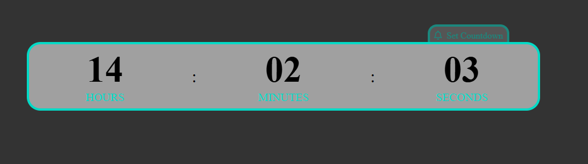
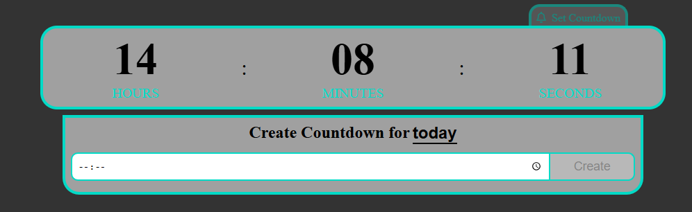
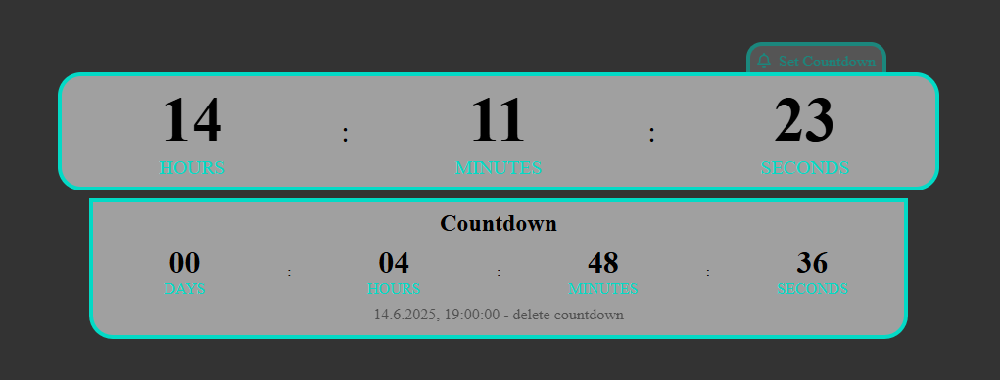

# Clock with countdown



## simple clock

A simple clock which you can use to see the current time in your browser tap. You can also set countdown which get saved into localStorage to be save when you accidently close the tap.

## countdown

### Create a countdown

Klick on the the small box named SET COUNTDOWN on the right top of the clock. A box apears to create the countdown.



When you click on the underlind word you can chnage the coundwon between **today** and **an other day**. Click on the button to create the button. (The countdown gets saved to the local Storage and appears as well when you close the tap and open it again.) The coundown is shown under the clock.



### good to know

- You can see when the timer ends when you look at the bottom of the box.
- Next to it you can delite the coundown with clicking on **delete countdown**
- When you create a new countdown while a coundown is running it gets replaced with the new one

## So you can clone the project

- First you copy the github download link

```bash
git clone https://github.com/DigitaleWeltLibrary/clock-with-countdown
```

- Then you have cloned the repository in your directory
- After that you have to install the node packages

```bash
npm install
```

- you are ready to start the app

```bash
npm run dev
```

## Used techniques

- vite
- react
- FontAwesomeIcon
